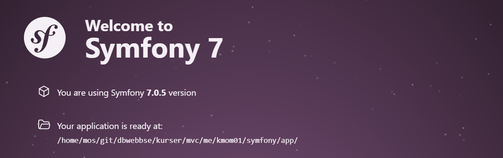

<!--
---
author: elk
---
-->



MVC Report
====================

Här nedan följer en manual för min report sida.


Dokumentation
----------------------------

För problem med symphone se - [documentation of the Symfony project](https://symfony.com/doc/current).


Prerequisites
----------------------------

You have installed PHP in the terminal.

You have installed Composer, the PHP package manager.


Run your app
-----------------------

1. Use Symphony built cli

symfony server:start

You can reach it through `http://127.0.0.1:8000`.

Needs to be installed, check dokumentation för symphone.


2. Use php bash

```bash
# You are in the app/ directory
php -S localhost:8888 -t public
```

You should now be able to open a web browser to `http://localhost:8888` and see the welcome page.

